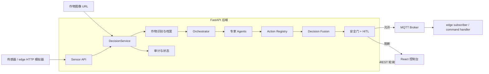

# 🌱 温室多智能体栽培系统

> **Multi-Agent Greenhouse Cultivation System**：一个面向温室环境的多智能体决策闭环。系统接收传感器读数和可选作物图像，由多个领域 Agent 并行分析，再经过动作注册表、决策融合、安全门和 HITL（Human-in-the-Loop）审核，最后在满足安全条件时通过 MQTT 发布执行器命令。

当前后端版本：`0.2.0` · FastAPI · Python · React · TypeScript · Vite

## 项目定位

本项目是一个可离线运行的温室控制原型，重点验证以下链路：

```text
传感器读数
    → 作物识别 / 作物档案
    → 多智能体并行分析
    → recommendation 动作注册与融合
    → 安全门 / 低置信度 / 设备互斥检查
    → MQTT dispatch 或 HITL
    → 审计、看板和前端展示
```

系统默认使用本地规则和本地作物档案，即使不配置 DeepSeek 或 MQTT Broker，也可以完成识别回退、决策分析、安全拦截和测试。

## 主要能力

- 传感器接入：温度、湿度、土壤湿度、pH、EC、光照、CO₂ 和可选图像 URL。
- 作物识别：支持番茄、生菜、草莓、黄瓜和辣椒；支持视觉模型、元数据关键词和本地回退。
- 作物档案：基于本地保守默认值，可选调用 DeepSeek 生成并持久化档案。
- 多智能体分析：土壤、温度、湿度、灌溉、光照/CO₂、生长阶段、病虫害和作物识别。
- 可复用决策服务：`decision_service.py` 将识别、调度、融合、安全、HITL、dispatch 和审计集中为一次完整运行，可被 API、传感器触发和其他任务复用。
- 动作注册表：`action_registry.py` 为 recommendation 登记执行器、动作、风险等级和 HITL 要求，未知 recommendation 变成结构化告警，不再静默丢弃。
- 安全控制：高温、越界 pH、低置信度、高风险动作、未知动作、农药动作以及 `heating + ventilation` 互斥组合都会阻断自动下发。
- MQTT dispatch：安全通过后发布到 `greenhouse/actuators/commands`；未配置 Broker 时安全返回 `skipped_no_broker`。
- HITL 审批：提供待审批、批准、拒绝接口，并把操作写入审计。
- React 控制台：总览、智能体、人工审批、历史审计和温室地图五个页面，默认每 4 秒轮询后端。
- SQLite 审计：运行时状态保存在内存，审计事件同时尝试写入 `greenhouse.db`。

## 系统架构



### 一次决策的实际执行顺序

`POST /api/agents/run` 只负责调用 `DecisionService.run()`，服务内部按以下顺序执行：

1. 如果当前作物档案不存在、置信度低于 `0.7` 且有图像，先运行作物识别。
2. 识别成功后生成或加载作物条件档案；低置信度或未知作物会创建 HITL 请求。
3. Orchestrator 并行运行专家 Agent，得到统一的 `{agent, confidence, findings, recommendations, risk_level}` 结果。
4. `DecisionFusionAgent` 根据 `action_registry.py` 将 recommendation 分类为执行命令、告警或 HITL 动作。
5. 安全层检查温度、pH、农药、低置信度、未知 recommendation、执行器白名单和设备互斥规则。
6. 只有通过安全门的命令才会调用 MQTT dispatch；否则写入 `state.hitl` 并返回结构化原因。
7. 决策、动作告警、Agent 输出、dispatch 状态和 HITL 事件写入内存状态与审计。

## 技术栈

| 层 | 技术 |
| --- | --- |
| 后端 | Python 3.11、FastAPI、Uvicorn、Pydantic |
| Agent | asyncio 并发、规则型 specialist、统一决策服务 |
| 可选模型 | DeepSeek OpenAI-compatible API |
| 执行通信 | paho-mqtt、MQTT JSON 命令 |
| 数据 | 进程内状态 + SQLite 审计 |
| 前端 | React 19、TypeScript 5.9、Vite 8 |
| 测试 | pytest、FastAPI TestClient |
| 部署 | Docker Compose 或本地 Python/Node 环境 |

## 快速开始

### 方式一：Docker Compose

要求：Docker Desktop 或 Docker Engine + Compose。

```bash
docker compose up
```

服务地址：

- 后端 API：<http://localhost:8000>
- Swagger 文档：<http://localhost:8000/docs>
- 前端控制台：<http://localhost:5173>

当前 Compose 文件只启动 API 和前端容器，不包含 MQTT Broker。需要真实 MQTT 下发时，请单独启动 Broker 并设置 `MQTT_BROKER`。

### 方式二：本地启动后端

Python 建议使用 3.11。

```bash
python -m venv .venv

# 在项目根目录Windows PowerShell

.\.venv\Scripts\python.exe -m uvicorn backend.app.main:app --reload --host 0.0.0.0 --port 8000

# macOS / Linux
# source .venv/bin/activate

pip install -r requirements.txt
uvicorn backend.app.main:app --reload --host 0.0.0.0 --port 8000
```

验证健康状态：

```bash
curl http://localhost:8000/api/health
```

预期返回：

```json
{"status":"ok","version":"0.2.0"}
```

### 本地启动前端

要求：Node.js `>=20.19.0`。前端开发服务器会把 `/api` 和 `/ws` 代理到 `localhost:8000`。

```bash
cd frontend
npm install
npm run dev
```

常用命令：

```bash
npm run typecheck
npm run build
npm run preview
```

### 运行模拟数据

启动后端后，在项目根目录运行：

```bash
python scripts/run_simulation.py
```

该脚本会发送三轮高温、较高湿度和土壤偏干数据，并请求决策接口。也可以运行持续传感器模拟器：

```bash
python edge/mqtt/publisher.py
```

注意：文件名虽然叫 `mqtt/publisher.py`，当前实现实际通过 HTTP `POST /api/sensors/readings` 上报随机读数；它不是传感器 MQTT 输入适配器。

## API 概览

完整接口以运行中的 Swagger 为准：<http://localhost:8000/docs>。

### 健康、传感器和看板

| 方法 | 路径 | 作用 |
| --- | --- | --- |
| `GET` | `/api/health` | 健康检查和版本 |
| `POST` | `/api/sensors/readings` | 写入最新传感器读数、历史和审计 |
| `GET` | `/api/sensors/latest` | 获取最新传感器读数 |
| `GET` | `/api/dashboard/summary` | 获取传感器、最新决策、Agent 数和待审批数 |
| `GET` | `/api/audit` | 获取全部内存审计事件 |
| `GET` | `/api/audit/history?limit=100` | 获取最近审计事件 |
| `GET` | `/api/config/thresholds` | 获取当前展示用阈值 |

传感器读数示例：

```bash
curl -X POST http://localhost:8000/api/sensors/readings \
  -H "Content-Type: application/json" \
  -d '{
    "device_id": "simulator-1",
    "temperature": 32,
    "humidity": 78,
    "soil_moisture": 22,
    "ph": 6.2,
    "ec": 1.5,
    "light": 500,
    "co2": 700
  }'
```

### 决策和 Agent

| 方法 | 路径 | 作用 |
| --- | --- | --- |
| `POST` | `/api/agents/run` | 运行一轮完整决策服务 |
| `GET` | `/api/agents/status` | 查看最近一次 Agent 结果 |
| `GET` | `/api/decisions` | 查看决策列表 |
| `GET` | `/api/decisions/latest` | 查看最新决策 |

`POST /api/agents/run` 返回的核心字段：

```json
{
  "id": "decision-id",
  "priority_actions": [
    {"actuator": "irrigation", "action": "on", "value": null, "reason": "soil"}
  ],
  "human_intervention": false,
  "explanation_for_farmer": "Routine environmental optimization",
  "dispatch": {"status": "skipped_no_broker", "count": 1},
  "action_alerts": [],
  "audit": {"agents": []}
}
```

`dispatch.status` 常见值：

- `published`：已发布到 MQTT。
- `skipped_no_broker`：未配置 Broker，安全跳过发布。
- `blocked_by_safety`：被安全门或 HITL 阻断。
- `blocked_unsafe_actuator`：执行器不在白名单中。
- `dispatch_failed`：MQTT 发布过程中发生异常。
- `nothing_to_dispatch`：本轮没有可执行命令。

### 作物识别与档案

| 方法 | 路径 | 作用 |
| --- | --- | --- |
| `POST` | `/api/agents/crop-identification` | 单次识别图像/元数据 |
| `POST` | `/api/agents/crop-identification/run` | 按启动、换季、换作物、周期等策略触发识别 |
| `POST` | `/api/agents/crop-identification/analyze` | 生成或分析作物条件档案 |
| `POST` | `/api/agents/crop-identification/confirm` | 人工确认作物并完成档案更新 |
| `GET` | `/api/agents/crop-identification/status` | 查看识别、档案和触发器状态 |

### HITL 和手工执行器命令

| 方法 | 路径 | 作用 |
| --- | --- | --- |
| `GET` | `/api/hitl/pending` | 查看待审批项 |
| `POST` | `/api/hitl/{id}/approve` | 批准一项 HITL 请求 |
| `POST` | `/api/hitl/{id}/reject` | 拒绝一项 HITL 请求 |
| `POST` | `/api/actuators/command` | 提交手工执行器命令，仍经过动作注册和安全门 |
| `WS` | `/ws/updates` | 返回一次状态快照；当前前端仍使用轮询 |

当前 HITL approve/reject 会更新请求状态并写入审计；批准不会自动重新执行原决策或自动 dispatch，需要后续业务流程显式再次触发决策。

## 动作注册表与安全策略

动作定义集中在 [backend/app/action_registry.py](backend/app/action_registry.py)。每项动作包含：

- `recommendation`：Agent 输出的建议名称。
- `actuator` / `action`：可执行时对应的执行器和动作。
- `risk_level`：风险等级。
- `requires_hitl`：是否必须人工审批。
- `kind`：`command`、`alert` 或 `hitl`。

主要执行器白名单：

```text
ventilation · irrigation · heating · mister
grow_light · shade · co2 · fan
```

以下动作不会自动执行：

| recommendation | 处理方式 |
| --- | --- |
| `adjust_ph` | 高风险，进入 HITL |
| `human_review_soil` | 进入 HITL |
| `human_review_temperature` | 进入 HITL |
| `human_review_irrigation` | 进入 HITL |
| `co2_enrichment_review` | 进入 HITL |
| `request_human_confirmation` | 进入 HITL |
| `drainage_check` | 结构化告警 |
| `notify_pest_agent` | 结构化告警 |
| `update_stage_thresholds` | 结构化告警 |
| 未注册 recommendation | 结构化未知动作告警并阻断 |
| `pesticide_on` | critical 风险，始终 HITL，且不在自动执行器白名单中 |

设备互斥规则当前至少包括：`heating_on` 和 `ventilation_on` 不允许同时自动开启。安全门还会拦截：

- 温度大于 `40` ℃。
- pH 小于 `4` 或大于 `8`。
- 任意农药命令。
- specialist 置信度低于 `0.7`（作物识别和生长阶段有专门例外逻辑）。
- 作物识别需要人工确认。
- 未注册动作、未知执行器和不满足设备互斥规则的命令。

## 配置

### 环境变量

| 变量 | 默认值 | 说明 |
| --- | --- | --- |
| `DEEPSEEK_API_KEY` | 空 | 不设置时使用本地识别/档案回退 |
| `DEEPSEEK_BASE_URL` | `https://api.deepseek.com/v1` | DeepSeek OpenAI-compatible API 地址 |
| `DEEPSEEK_MODEL` | `deepseek-chat` | 文本模型 |
| `DEEPSEEK_VISION_MODEL` | 与文本模型相同 | 图像识别模型 |
| `DEEPSEEK_TIMEOUT` | `30` | 请求超时秒数 |
| `DEEPSEEK_RETRIES` | `2` | 重试次数 |
| `MQTT_BROKER` | 空 | 配置后才实际发布 MQTT 命令 |
| `MQTT_ACTUATOR_TOPIC` | `greenhouse/actuators/commands` | 执行器命令主题 |
| `CROP_PROFILE_PATH` | `config/crop_profiles.json` | 作物档案存储路径 |
| `VITE_API_BASE` | 空 | 前端生产环境 API 基地址 |

仓库中的 `config/settings.yaml`、`config/safety_rules.yaml` 和其他 YAML 文件用于保存规划配置或默认值；当前部分运行参数仍直接从环境变量和代码读取，不能把所有 YAML 字段视为已接入的动态配置。

## MQTT 与边缘端

后端安全通过后，将每条命令作为 JSON 发布到：

```text
greenhouse/actuators/commands
```

边缘端入口：

- `edge/mqtt/subscriber.py`：连接 MQTT 并订阅命令。
- `edge/mqtt/command_handler.py`：校验执行器白名单并调用可注入 handler。
- `edge/drivers/`：传感器驱动预留目录。
- `edge/control/`：执行器控制预留目录。

默认 edge handler 只记录命令，不直接操作真实硬件。接入硬件前必须增加物理急停、断电保护、权限控制和设备级限位。

## 项目结构

```text
.
├── backend/
│   └── app/
│       ├── main.py                 # FastAPI 应用入口
│       ├── api/                    # HTTP / WebSocket 路由
│       ├── decision_service.py     # 一次完整决策运行服务
│       ├── action_registry.py      # recommendation 与执行/告警/HITL 注册表
│       ├── agents/                 # Orchestrator、specialist、融合 Agent
│       ├── crop_identification_agent.py
│       ├── crop_profile.py
│       ├── schemas.py              # Pydantic 请求模型
│       ├── state.py                 # 进程内运行状态
│       ├── services.py              # 审计与安全门
│       ├── tools/                   # MQTT dispatch
│       └── db/                      # SQLite 审计写入
├── frontend/                       # React + TypeScript + Vite 控制台
├── edge/                           # MQTT 订阅器、模拟器和硬件适配预留
├── config/                         # 作物档案与规划配置
├── scripts/                        # 模拟、评估和校准脚本
├── tests/                          # 冒烟、管线、服务和动作注册测试
├── docs/                           # API、架构、安全、部署和运维文档
├── docker-compose.yml
├── requirements.txt
└── README.md
```

## 测试与质量检查

运行后端测试：

```bash
python -m pytest -q
```

当前测试覆盖：

- `/api/health` 冒烟检查。
- 作物识别 → 档案 → Orchestrator → 融合 → 安全 → dispatch 管线。
- 正常、危险、低置信度和 dispatch 失败决策服务场景。
- HITL approve 通过统一决策服务处理。
- 全部 Agent recommendation 注册情况。
- 未知 recommendation 结构化告警。
- 农药、高风险 pH、执行器白名单和设备互斥规则。
- 手工执行器命令与自动命令共用动作注册表和安全门。

运行前端检查：

```bash
cd frontend
npm run typecheck
npm run build
```

## 当前边界与后续工作

已接入：

- FastAPI REST API、React 控制台和基础 WebSocket 路由。
- 本地规则型专家 Agent 并行分析。
- 可选 DeepSeek 作物识别和作物档案生成。
- 统一决策服务、动作注册表、安全门、HITL 和 MQTT dispatch。
- SQLite 审计和完整服务级测试。

当前限制：

- 运行状态保存在进程内，服务重启后最新读数、决策和待审批列表会丢失；审计可写入 SQLite。
- `/ws/updates` 当前只发送一次快照，前端使用 4 秒轮询。
- 专家 Agent 主要是本地规则实现，Prompt 已加载但未统一交给 LLM 执行。
- Compose 不包含 MQTT Broker，未配置 `MQTT_BROKER` 时不会真实下发。
- `/api/actuators/command` 当前只更新状态和审计，不直接调用 MQTT dispatch。
- edge 驱动、真实执行器、病虫害视觉推理和固件目录仍属于扩展接口或预留实现。
- 配置 YAML 尚未完全统一接入运行时配置加载。

## 文档导航

- [API 说明](docs/api.md)
- [系统架构](docs/architecture.md)
- [项目文件职责地图](docs/project-map.md)
- [安全与 HITL](docs/safety.md)
- [MQTT 协议](docs/mqtt.md)
- [部署指南](docs/deployment.md)
- [前端说明](docs/frontend.md)
- [测试说明](docs/testing.md)
- [故障排查](docs/troubleshooting.md)
- [硬件接入](docs/hardware.md)
- [数据库审计](docs/database.md)
- [用户手册](docs/user_manual.md)

## 安全声明

本项目面向研究、教学和仿真用途，未附带生产级许可证。接入真实温室前，请完成硬件级风险评估，并至少配置：

- 物理急停和断电保护。
- 执行器的独立限位与故障回退。
- MQTT 认证、网络隔离和最小权限。
- 人工审批、审计留存和异常告警。
- 传感器校准、阈值验证和现场联调。

不要把当前原型的安全门、模拟状态或默认阈值直接视为真实农业生产环境的充分安全措施。
