# Multi-Agent Greenhouse Cultivation System

Run: uvicorn backend.app.main:app --reload
# 项目结构与文件职责导览

状态标记：**已接入**表示当前主流程已调用；**部分实现**表示有可运行逻辑但数据或规则仍有限；**骨架**表示目录或文件已建立但功能尚未完整实现。

## 自上而下的项目分支图

```mermaid
flowchart TD
    A[温室多智能体种植系统]
    A --> B[项目启动与入口]
    B --> B1[README.md 项目介绍与启动]
    B --> B2[docker-compose.yml 容器编排]
    B --> B3[requirements.txt Python依赖]
    B --> B4[backend/app/main.py FastAPI与当前API入口]
    A --> C[后端业务 backend/app]
    C --> C1[main.py 当前传感器、Agent、决策、HITL、审计路由]
    C --> C2[agents 多智能体协作]
    C2 --> C21[orchestrator.py 并行调��� 已接入]
    C2 --> C22[registry.py Agent注册 已接入]
    C2 --> C23[作物识别 Agent 已接入]
    C2 --> C24[土壤、温度、湿度 Agent 已接入或部分实现]
    C2 --> C25[灌溉、光照CO2、生长阶段 Agent 部分实现]
    C2 --> C26[decision_agent.py 决策融合 已接入]
    C2 --> C27[hitl_agent.py 安全与人工介入 已接入]
    C2 --> C28[病虫害、记忆、graph 骨架]
    C --> C3[schemas.py 数据结构]
    C --> C4[services.py 安全规则与审计]
    C --> C5[db SQLite审计与模型]
    A --> D[Prompt backend/app/prompts]
    D --> D1[各领域与系统节点 Markdown Prompt]
    D --> D2[prompt_loader.py 变量替换与fallback]
    A --> E[config 配置]
    E --> E1[settings.yaml 应用与周期]
    E --> E2[safety_rules.yaml 安全阈值]
    E --> E3[agents/devices/thresholds.yaml 设备与作物配置]
    A --> F[edge 边缘设备]
    F --> F1[mqtt/publisher.py 模拟上报]
    F --> F2[drivers 传感器驱动骨架]
    F --> F3[control 执行器骨架]
    A --> G[frontend 前端]
    G --> G1[src/main.tsx 看板入口]
    G --> G2[src/pages 页面]
    G --> G3[src/components 组件]
    A --> H[tests 与 scripts]
    H --> H1[test_smoke.py 冒烟测试]
    H --> H2[run_simulation.py 仿真]
    H --> H3[知识、评估、校准脚本]
    A --> I[docs 文档]
    I --> I1[架构、API、安全]
    I --> I2[部署、运维、硬件、MQTT、数据库]
    I --> I3[前端、测试、排障、用户手册]
    I --> I4[competition 演示材料]
    A --> J[data、deploy、notebooks]
    J --> J1[data 数据目录]
    J --> J2[deploy 部署扩展]
    J --> J3[notebooks 实验分析]
```



## 一、项目根目录

- `README.md`：项目简介和快速启动。
- `requirements.txt`：后端依赖。
- `docker-compose.yml`：API 与前端演示容器编排。
- `backend/Dockerfile`：后端镜像构建。
- `greenhouse.db`：当前开发环境 SQLite 审计数据库。

## 二、后端主链路

- `backend/app/main.py`：FastAPI 应用和当前主要 API 入口。
- `backend/app/schemas.py`：传感器读数、作物识别触发请求、执行器命令的数据结构。
- `backend/app/agents/orchestrator.py`：并行调度专家 Agent。
- `backend/app/agents/registry.py`：注册和创建 Agent。
- `backend/app/agents/base.py`：Agent 基类和统一结果格式。
- `backend/app/services.py`：安全判断和审计事件。
- `backend/app/db/session.py`：SQLite 审计表初始化和写入。

## 三、多智能体目录

- `crop_identification_agent.py`：作物种类、品种和档案识别。
- `soil_agent.py`：土壤水分、pH、EC 等土壤领域。
- `temperature_agent.py`：空气温度、热害和冷害。
- `humidity_agent.py`：空气湿度、VPD、结露和病害传播风险。
- `irrigation_agent.py`：土壤水分、天气、阀门和灌溉策略。
- `light_co2_agent.py`：光照、DLI、CO2、补光和遮阳。
- `crop_stage_agent.py`：苗期、营养期、开花、坐果、成熟等阶段。
- `decision_agent.py`：融合专家建议，生成候选执行动作。
- `hitl_agent.py`：判断 `allow` 或 `need_hitl`，高风险动作不得直接执行。
- `specialists.py`：部分尚未独立实现的专家使用的通用规则逻辑。
- `memory_agent.py`、`graph/`：记忆和图式工作流扩展位置，目前仍需完善。

## 四、Prompt 目录

`backend/app/prompts/` 只存放 Prompt Markdown，不承载 Python 执行逻辑。当前已保存的 Prompt 包括：`crop_identification`、`soil`、`temperature`、`humidity`、`irrigation`、`light_co2`、`crop_stage`、`orchestrator`、`decision_fusion`、`hitl`、`memory`。

`backend/app/prompt_loader.py` 负责读取 Prompt、替换 `{{变量}}`，并在文件缺失时提供 fallback。具体领域 Prompt 应由用户提供，不能擅自生成。

## 五、配置目录

- `settings.yaml`：应用、数据库、MQTT 和作物识别周期。
- `safety_rules.yaml`：温度、pH、设备和化学投入品安全规则。
- `agents.yaml`：Agent 启用和调度配置目标。
- `devices.yaml`：设备清单配置目标。
- `thresholds.yaml`：作物阈值配置目标。

当前部分默认阈值仍在代码中，配置文件尚未全部成为唯一运行时来源。

## 六、边缘、前端和测试

- `edge/mqtt/publisher.py`：模拟传感器上报。
- `edge/mqtt/subscriber.py`：执行器命令订阅扩展。
- `edge/drivers/`：真实传感器驱动扩展。
- `edge/control/`：继电器、阀门和风机控制扩展。
- `frontend/src/main.tsx`：React 看板入口。
- `frontend/src/pages/`：Dashboard、Agents、HITL、地图、History 页面。
- `frontend/src/components/`：传感器卡片、Agent 卡片、决策和告警组件。
- `tests/test_smoke.py`：健康检查冒烟测试。
- `scripts/run_simulation.py`：模拟数据并触发 Agent。

## 七、一轮运行顺序

```text
传感器/图像数据
  -> main.py API
  -> Orchestrator
  -> 专家 Agent 并行分析
  -> DecisionFusionAgent
  -> SafetyHITLAgent
  -> 自动执行或 HITL 审批
  -> 审计日志与前端看板
```

> 重要边界：Prompt 已保存并加载，不代表已经连接真实 LLM。没有 LLM 客户端时，系统使用本地规则/Mock 逻辑；目录存在也不代表所有骨架模块已经完整实现。