# 项目分支图与文件职责

> 本文按当前工作区源码整理。`__pycache__/` 是 Python 运行缓存，`greenhouse.db` 是运行时 SQLite 文件，不在功能分支图中展开。

状态标记：**已接入**=当前入口会调用或已有可运行逻辑；**部分实现**=有规则/接口但仍缺少真实设备、完整策略或联调；**占位**=只有 `Placeholder`；**运行产物**=运行时生成或修改。

## 1. 先看懂系统：两张图

### 1.1 目录分支图

```mermaid
flowchart TD
    ROOT[Multi-Agent Greenhouse Cultivation System]
    ROOT --> R[根目录入口与运行]
    R --> R1[README.md 项目概览]
    R --> R2[requirements.txt Python依赖]
    R --> R3[docker-compose.yml 本地容器编排]
    R --> R4[greenhouse.db 运行时审计库]

    ROOT --> B[backend 后端]
    B --> B0[app/main.py FastAPI入口]
    B --> B1[app/api HTTP/WebSocket路由]
    B --> B2[app/agents 多智能体协作]
    B --> B3[schemas.py 请求/数据模型]
    B --> B4[state.py 进程内状态]
    B --> B5[services.py 安全与审计]
    B --> B6[db/session.py SQLite写入]
    B --> B7[prompts Prompt文本]
    B --> B8[DeepSeek与作物档案]
    B --> B9[tools/core/db/models 扩展骨架]

    ROOT --> C[config 配置]
    C --> C1[settings.yaml 应用/MQTT/模型参数]
    C --> C2[crop_profiles.json 作物条件档案]
    C --> C3[safety_rules/agents/devices/thresholds 配置]

    ROOT --> E[edge 边缘侧]
    E --> E1[mqtt publisher/subscriber]
    E --> E2[drivers 传感器驱动]
    E --> E3[control 执行器控制]
    E --> E4[inference 病虫害推理]

    ROOT --> F[frontend 前端]
    F --> F1[src/main.tsx 当前看板]
    F --> F2[src/pages 页面预留]
    F --> F3[src/components 组件预留]

    ROOT --> G[docs 设计、接口、运维、演示]
    ROOT --> H[scripts/tests/notebooks]
    ROOT --> I[deploy 部署扩展]
```

### 1.2 当前真实的控制链

```mermaid
flowchart LR
    SENSOR[HTTP传感器或 edge/mqtt/publisher.py]
      --> INGEST[POST /api/sensors/readings]
      --> STATE[state.latest/history]
      --> RUN[POST /api/agents/run]

    RUN --> IDENT{无作物档案且有图像?}
    IDENT -->|是| CROP[顶层 crop_identification_agent.py]
    CROP --> PROFILE[crop_profile.py<br/>DeepSeek或本地档案]
    IDENT -->|否| ORCH[agents/orchestrator.py]
    PROFILE --> ORCH
    ORCH --> REG[registry.build_agents]
    REG --> SPEC[土壤/温度/湿度/灌溉/光照CO2/阶段]
    REG --> PEST[RuleAgent: pest]
    SPEC --> FUSE[DecisionFusionAgent.fuse]
    PEST --> FUSE
    ORCH --> FUSE
    FUSE --> GATE[SafetyHITLAgent + services.safety]
    GATE -->|阻断| HITL[state.hitl + audit]
    GATE -->|通过| DISPATCH[tools/actuator_dispatch.py]
    DISPATCH -->|有MQTT_BROKER| MQTT[MQTT greenhouse/actuators/commands]
    DISPATCH -->|无Broker| SKIP[skipped_no_broker]
    GATE --> DEC[state.decisions + audit]
    DEC --> UI[dashboard/decisions/WebSocket]
```

关键理解：现在的 MQTT 下发只发生在 `/api/agents/run` 生成的命令通过安全门之后；未配置 `MQTT_BROKER` 时只返回 `skipped_no_broker`。直接 `/api/actuators/command` 会经过融合白名单和安全检查，但当前只更新状态/审计，不直接调用 MQTT dispatch。

## 2. 根目录

| 文件 | 功能 | 状态 |
|---|---|---|
| `README.md` | 项目简介、启动命令和粗粒度结构导览。 | 已接入/概览 |
| `requirements.txt` | FastAPI、Uvicorn、Pydantic、httpx、pytest、paho-mqtt 等后端依赖（阶段 1 已固定版本）。 | 已接入/已固定 |
| `docker-compose.yml` | 启动 API 与前端开发容器；容器内安装依赖并运行 Uvicorn/Vite。 | 部分实现 |
| `greenhouse.db` | SQLite 运行产物，主要保存 `audit` 表。 | 运行产物 |

## 3. `backend`：后端应用

### 3.1 入口、状态、模型、服务

| 文件 | 功能 | 状态 |
|---|---|---|
| `backend/__init__.py` | Python 包标记。 | 已接入 |
| `backend/app/__init__.py` | 应用包标记。 | 已接入 |
| `backend/app/main.py` | 创建 FastAPI，开启 CORS，挂载 sensors/agents/decisions/hitl/actuators/dashboard/ws 路由。 | 已接入 |
| `backend/app/agents.py` | 旧版单文件 Agent 调度；当前 FastAPI 主入口使用的是 `backend/app/agents/` 包。 | 重复/旧入口 |
| `backend/app/schemas.py` | `SensorReading`、`CropTriggerRequest`、`ActuatorCommand` 三类 Pydantic 数据模型。 | 已接入 |
| `backend/app/state.py` | 最新传感器、历史、决策、HITL、Agent 缓存、作物档案、天气、执行器状态。主要是进程内状态，重启会丢失。 | 已接入/非持久化 |
| `backend/app/services.py` | `audit()` 写内存事件并尝试写 SQLite；`safety()` 拦截极端温度、越界 pH、农药命令。 | 已接入/部分硬编码 |
| `backend/app/prompt_loader.py` | 优先读取 `backend/prompts`；只有新目录不存在时才整体回退到旧目录 `backend/app/prompts`；同时替换模板变量并清理未解析 token。 | 已接入 |
| `backend/app/services/prompt_loader.py` | 顶层 PromptLoader 的兼容导出。 | 已接入/兼容层 |
| `backend/app/deepseek_client.py` | OpenAI 兼容的 DeepSeek JSON 客户端；支持图片、超时、重试和 JSON 清洗。 | 已接入/可选外部服务 |
| `backend/app/core/logging.py` | 配置标准 Python 日志。 | 已接入 |
| `backend/app/core/config.py` | 统一配置读取预留。 | 占位 |
| `backend/app/core/constants.py` | 常量集中定义预留。 | 占位 |
| `backend/app/core/security.py` | 认证/授权安全层预留。 | 占位 |

### 3.2 API 路由

| 文件 | 路由与职责 | 状态 |
|---|---|---|
| `backend/app/api/__init__.py` | API 包标记。 | 已接入 |
| `backend/app/api/sensors.py` | `POST /api/sensors/readings` 更新读数、历史和审计；`GET /api/sensors/latest` 查询。 | 已接入 |
| `backend/app/api/agents.py` | `POST /api/agents/run` 完成识别/档案、并行 Agent、决策融合、安全/HITL、MQTT dispatch；另有作物识别、分析、确认、状态接口。 | 已接入/主业务入口 |
| `backend/app/api/decisions.py` | 查询决策列表和最新决策。 | 已接入 |
| `backend/app/api/hitl.py` | 查询 pending HITL，支持 approve/reject 并审计。 | 已接入（批准后没有自动重跑决策） |
| `backend/app/api/actuators.py` | 手工命令走 DecisionFusion 白名单和安全门；通过后更新执行器状态并审计。 | 部分实现 |
| `backend/app/api/dashboard.py` | 看板汇总、审计、审计历史、硬编码阈值、健康检查。 | 已接入 |
| `backend/app/api/ws.py` | WebSocket 建连后发送一次状态快照；没有持续推送循环。 | 部分实现 |

### 3.3 多智能体 `backend/app/agents/`

| 文件 | 功能 | 状态 |
|---|---|---|
| `backend/app/agents/__init__.py` | 暴露 `orchestrator`、`run_all` 和 Agent 名称。 | 已接入 |
| `backend/app/agents/base.py` | Agent 基类及统一结果字段。 | 已接入 |
| `backend/app/agents/orchestrator.py` | 构造作物/传感器/历史/天气/执行器上下文，并发运行 registry 中 Agent；已有档案时避免重复识别。 | 已接入 |
| `backend/app/agents/registry.py` | 构造 soil、temperature、humidity、irrigation、light_co2、crop_stage；pest 用 RuleAgent。 | 已接入 |
| `backend/app/agents/specialists.py` | 通用规则 Agent，目前主要承接 pest。 | 部分实现 |
| `backend/app/agents/soil_agent.py` | 判断 pH、EC、土壤水分，生成调 pH、灌溉、排水或人工复核建议。 | 部分实现 |
| `backend/app/agents/temperature_agent.py` | 按作物温度档案判断加热、通风和 P0 紧急风险。 | 部分实现 |
| `backend/app/agents/humidity_agent.py` | 判断高低湿、结露/病害风险、通风和喷雾。 | 部分实现 |
| `backend/app/agents/irrigation_agent.py` | 判断灌溉、停灌、排水和阀故障。 | 部分实现 |
| `backend/app/agents/light_co2_agent.py` | 判断补光、遮阳、CO2 建议。 | 部分实现 |
| `backend/app/agents/crop_stage_agent.py` | 读取当前档案生长阶段并建议更新阶段阈值。 | 部分实现 |
| `backend/app/agents/decision_agent.py` | 去重并把建议字符串映射成安全候选执行器命令，同时加载融合 Prompt。 | 部分实现 |
| `backend/app/agents/hitl_agent.py` | 对极端温度、越界 pH、农药命令返回 `allow`/`need_hitl`。 | 已接入/规则有限 |
| `backend/app/agents/crop_identification_agent.py` | 顶层识别 Agent 的向后兼容导出，避免旧 import 失效。 | 已接入/兼容层 |
| `backend/app/agents/memory_agent.py` | 记忆与经验学习 Agent 预留。 | 占位 |
| `backend/app/agents/pest_agent.py` | 独立病虫害 Agent 预留；当前由 RuleAgent 代替。 | 占位 |
| `backend/app/agents/graph/workflow.py` | 图式工作流入口预留。 | 占位 |
| `backend/app/agents/graph/edges.py` | 图式工作流边和条件路由预留。 | 占位 |
| `backend/app/agents/graph/state.py` | 图式工作流状态预留。 | 占位 |

### 3.4 作物、数据库与工具

| 文件 | 功能 | 状态 |
|---|---|---|
| `backend/app/crop_identification_agent.py` | 先调用 DeepSeek（若配置 Key），失败时按图片 URL/元数据关键词 fallback；低置信度或未知作物要求人工确认。 | 已接入 |
| `backend/app/crop_profile.py` | 管理番茄/生菜/草莓/黄瓜/辣椒默认档案；可让 DeepSeek生成并归一化，持久化到 `config/crop_profiles.json`。 | 已接入/本地 fallback |
| `backend/app/crop_trigger.py` | 管理 startup、换季、换作物、档案不匹配和 168 小时周期触发。 | 已接入/内存状态 |
| `backend/app/db/session.py` | 原生 sqlite3 创建 `audit` 表并写审计。 | 已接入 |
| `backend/app/db/models/actuator.py` | 执行器 ORM/模型预留。 | 占位 |
| `backend/app/db/models/audit.py` | 审计 ORM/模型预留；实际写入仍在 session.py。 | 占位 |
| `backend/app/db/models/decision.py` | 决策模型预留。 | 占位 |
| `backend/app/db/models/hitl.py` | HITL 模型预留。 | 占位 |
| `backend/app/db/models/sensor.py` | 传感器模型预留。 | 占位 |
| `backend/app/tools/actuator_dispatch.py` | 对安全后的命令做执行器白名单检查；有 Broker 时批量发布 MQTT，无 Broker 时返回跳过。 | 已接入 |
| `backend/app/tools/actuator_tool.py` | `actuator_dispatch` 的兼容导出。 | 已接入/兼容层 |
| `backend/app/tools/image_tool.py` | 图像工具预留。 | 占位 |
| `backend/app/tools/rag_tool.py` | RAG/知识库工具预留。 | 占位 |
| `backend/app/tools/sensor_tool.py` | 传感器工具预留。 | 占位 |
| `backend/app/tools/weather_tool.py` | 天气工具预留。 | 占位 |

### 3.5 Prompt 文件

当前 `PromptLoader` 优先读取 `backend/prompts/*.md`；`backend/app/prompts/` 是旧兼容目录（按目录整体回退）。Prompt 只描述角色、输入变量和输出 JSON 约束，不负责执行 Python 或直接控制设备。

| 文件 | 存放内容 |
|---|---|
| `backend/prompts/crop_identification.md` | 作物识别 JSON、置信度和人工确认条件。 |
| `backend/prompts/crop_profile.md` | 作物阶段与温湿度/光照/CO2/pH/EC/水分档案生成。 |
| `backend/prompts/crop_stage.md` | 生长阶段判断。 |
| `backend/prompts/decision_fusion.md` | 专家结果融合为候选执行命令。 |
| `backend/prompts/humidity.md` | 湿度/VPD/结露风险。 |
| `backend/prompts/irrigation.md` | 灌溉、水分、天气、阀门状态。 |
| `backend/prompts/light_co2.md` | 光照、DLI、CO2、补光、遮阳。 |
| `backend/prompts/orchestrator.md` | 调度和数据上下文。 |
| `backend/prompts/soil.md` | pH、EC、土壤水分。 |
| `backend/prompts/temperature.md` | 温度、热害和冷害。 |
| `backend/app/prompts/*.md` | 旧版较详细的中文 Prompt；作为兼容内容保留。 | 

## 4. `config/` 配置与档案

| 文件 | 设计用途 | 当前情况 |
|---|---|---|
| `config/settings.yaml` | 应用名、数据库、MQTT 主题、作物识别周期、DeepSeek 模型/重试参数。 | 有内容；部分参数仍由环境变量读取。 |
| `config/crop_profiles.json` | 已保存的作物条件档案，当前已有番茄本地 fallback 档案。 | 已接入 |
| `config/safety_rules.yaml` | 温度和 pH 安全阈值。 | 文件存在，但部分运行规则仍在 Python 中。 |
| `config/agents.yaml` | Agent 启用/调度配置预留。 | 占位 |
| `config/devices.yaml` | 设备清单预留。 | 占位 |
| `config/thresholds.yaml` | 阈值集中配置预留。 | 占位 |

## 5. `edge/` 边缘设备

| 文件 | 功能 | 状态 |
|---|---|---|
| `edge/requirements.txt` | 边缘侧 paho-mqtt 依赖。 | 已接入 |
| `edge/mqtt/publisher.py` | 每 5 秒生成随机传感器读数并通过 HTTP 写入后端；名称虽含 MQTT，当前是 HTTP 模拟器。 | 部分实现 |
| `edge/mqtt/subscriber.py` | 启动 MQTT 执行器命令订阅。 | 已接入 |
| `edge/mqtt/command_handler.py` | 解析 JSON、校验执行器白名单并调用可注入 Handler。 | 已接入/默认只记录日志 |
| `edge/drivers/camera.py` | 摄像头驱动预留。 | 占位 |
| `edge/drivers/humidity.py` | 湿度驱动预留。 | 占位 |
| `edge/drivers/ph_ec.py` | pH/EC 驱动预留。 | 占位 |
| `edge/drivers/soil_moisture.py` | 土壤水分驱动预留。 | 占位 |
| `edge/drivers/temperature.py` | 温度驱动预留。 | 占位 |
| `edge/control/fan.py` | 风机控制预留。 | 占位 |
| `edge/control/relay.py` | 继电器控制预留。 | 占位 |
| `edge/control/valve.py` | 阀门控制预留。 | 占位 |
| `edge/inference/pest_detection.py` | 边缘病虫害推理预留。 | 占位 |

## 6. `frontend/` 前端

| 文件 | 功能 | 状态 |
|---|---|---|
| `frontend/index.html` | Vite HTML 容器，加载 `src/main.tsx`。 | 已接入 |
| `frontend/package.json` | React/Vite/TypeScript 依赖及 dev/build 脚本。 | 已接入 |
| `frontend/src/main.tsx` | 当前最小看板：请求 dashboard summary，显示传感器、Agent 数和待审批数。 | 部分实现 |
| `frontend/src/style.css` | 当前页面基础样式。 | 已接入/简版 |
| `frontend/src/App.tsx` | App 组件预留。 | 占位 |
| `frontend/src/components/AgentCard.tsx` | Agent 卡片预留。 | 占位 |
| `frontend/src/components/AlertBanner.tsx` | 告警条预留。 | 占位 |
| `frontend/src/components/DecisionPanel.tsx` | 决策面板预留。 | 占位 |
| `frontend/src/components/SensorCard.tsx` | 传感器卡片预留。 | 占位 |
| `frontend/src/pages/Agents.tsx` | Agent 页面预留。 | 占位 |
| `frontend/src/pages/Dashboard.tsx` | 看板页面预留。 | 占位 |
| `frontend/src/pages/GreenhouseMap.tsx` | 温室地图页面预留。 | 占位 |
| `frontend/src/pages/History.tsx` | 历史记录页面预留。 | 占位 |
| `frontend/src/pages/HITL.tsx` | 人工审批页面预留。 | 占位 |
| `frontend/src/services/api.ts` | API 封装预留。 | 占位 |
| `frontend/tsconfig.json` | TypeScript 配置预留。 | 占位 |
| `frontend/vite.config.ts` | Vite 配置预留。 | 占位 |
| `frontend/Dockerfile` | 前端镜像构建预留。 | 占位 |

## 7. `docs/` 文档分别放什么

| 文档 | 内容 |
|---|---|
| `docs/README.md` | 文档目录入口；当前是 Placeholder。 |
| `docs/project-map.md` | 本文件：分支图、运行链路、文件职责和缺口。 |
| `docs/architecture.md` | Orchestrator→专家 Agent→Decision Fusion→HITL 的目标架构。 |
| `docs/api.md` | FastAPI 接口、作物识别接口和控制闭环说明。 |
| `docs/agent_prompts.md` | Prompt 变量、加载目录和 specialist→融合→HITL→MQTT 顺序。 |
| `docs/crop-identification.md` | 作物识别触发、置信度、人工确认、档案分析。 |
| `docs/database.md` | SQLite 审计表及未来 PostgreSQL/Alembic 建议。 |
| `docs/deployment.md` | pip、uvicorn、docker compose 启动方法。 |
| `docs/frontend.md` | Vite + React + TypeScript 前端说明。 |
| `docs/implementation-status.md` | 阶段 1 实施状态：验收核对、可用入口、占位模块、已知限制、初始问题清单。 |
| `docs/hardware.md` | 传感器、继电器和断电安全要求。 |
| `docs/mqtt.md` | 传感器/执行器主题和 JSON 约定。 |
| `docs/operations.md` | 健康检查、审计查询、数据库位置。 |
| `docs/safety.md` | 极端温度、危险 pH、农药命令的人工审批原则。 |
| `docs/setup.md` | 阶段 1 统一环境搭建与启动说明（venv、pnpm、统一测试命令）。 |
| `docs/testing.md` | pytest 和仿真脚本用法。 |
| `docs/troubleshooting.md` | 端口、HITL、SQLite 排查提示。 |
| `docs/user_manual.md` | 安装、启动、访问 `/docs` 和运行仿真。 |
| `docs/competition/README.md` | 赛事演示范围。 |
| `docs/competition/demo-script.md` | 正常读数与 `temperature=45` 的演示步骤。 |

这些文档中有一部分描述的是目标态。是否“真的接通”应以源码的 import 和调用链为准；例如配置 YAML 并非全部被读取，前端页面和边缘驱动也仍有占位文件。

## 8. 脚本、测试、Notebook、部署

| 文件/目录 | 功能 | 状态 |
|---|---|---|
| `scripts/run_simulation.py` | 发送三轮异常读数并触发 `/api/agents/run`，用于手工演示。 | 已接入 |
| `scripts/calibrate_sensors.py` | 传感器校准预留。 | 占位 |
| `scripts/eval_agents.py` | Agent 评估预留。 | 占位 |
| `scripts/seed_knowledge.py` | 知识库初始化预留。 | 占位 |
| `tests/test_smoke.py` | TestClient 健康检查。 | 已接入 |
| `tests/test_crop_pipeline.py` | 验证识别→档案→Orchestrator→融合→安全→dispatch 的离线链路，以及未知作物 HITL。 | 已接入 |
| `notebooks/pest_detection.ipynb` | 病虫害实验预留。 | 占位 |
| `notebooks/threshold_analysis.ipynb` | 阈值分析预留。 | 占位 |
| `backend/Dockerfile` | Python 3.11 后端镜像并启动 Uvicorn。 | 已接入 |
| `deploy/mosquitto/mosquitto.conf` | Mosquitto 配置预留。 | 占位 |
| `deploy/nginx/nginx.conf` | Nginx 反向代理预留。 | 占位 |
| `data/raw/`、`processed/`、`uploads/`、`logs/`、`vector_store/` | 原始/处理/上传/日志/向量知识库目录。 | 当前为空目录 |
| `deploy/docker/`、`deploy/grafana/`、`deploy/k8s/` | 容器、监控、Kubernetes 扩展目录。 | 当前为空目录 |

## 9. 推荐读代码顺序

1. `backend/app/main.py`：确认服务挂载了哪些入口。
2. `backend/app/api/agents.py`：理解当前主业务闭环。
3. 沿 `run()` 阅读 `crop_identification_agent.py`、`crop_profile.py`、`agents/orchestrator.py`、`agents/registry.py`。
4. 阅读 specialists，再看 `decision_agent.py`、`hitl_agent.py` 和 `tools/actuator_dispatch.py`。
5. 最后看 `services.py`、`db/session.py`、`state.py`，掌握安全、审计和重启后的数据边界。
6. 需要扩展功能时，再进入 `config/`、`edge/`、`frontend/src/pages/`、`graph/`、`tools/` 和 `deploy/`。

## 10. 当前最重要的缺口

1. **specialist 主要仍是本地规则**：它们会加载 Prompt，但没有像作物识别/档案分析那样直接调用 DeepSeek。
2. **执行器链路是可选的**：没有 `MQTT_BROKER` 时不下发；真实传感器驱动和控制器仍为空。
3. **配置不是单一事实来源**：YAML 的 Agent、设备、阈值配置没有统一加载，部分规则仍写在 Python 中。
4. **状态主要在内存**：决策、HITL、最新读数、档案上下文会受进程重启影响；SQLite 目前主要存审计。
5. **前端仍是最小页面**：路由页、组件和 API 封装只是骨架。
6. **图工作流、记忆、RAG、天气、真实传感器尚未实现**：目录表示未来扩展方向，不表示当前可用。
