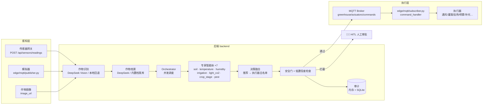

# 🌱 温室多智能体栽培系统

> **Multi-Agent Greenhouse Cultivation System** — 一个端到端的温室栽培决策闭环：传感器读数进入系统后，由多个领域专家智能体并行分析，经决策融合与安全门（HITL 人工审批）把关，最终通过 MQTT 下发到边缘执行器；同时提供实时 React 控制台用于监控、审批与审计。

当前版本：**v0.2.0** · 后端 FastAPI + Python · 前端 React 19 + Vite · 可选接入 DeepSeek 大模型（无 Key 时自动退回本地规则）

---

## ✨ 功能特性

- **感知接入**：HTTP 上报传感器读数（温度、湿度、土壤水分、pH、EC、光照、CO₂、作物图像 URL），支持模拟器与真实网关两种数据源。
- **作物识别与档案**：图像 / 元数据识别作物（番茄、生菜、草莓、黄瓜、辣椒），低置信度自动转入人工确认；识别后生成或加载该作物的环境条件档案。
- **多智能体并行分析**：土壤、温度、湿度、灌溉、光照 CO₂、生长阶段、病虫害 7 个专家智能体并发运行，输出发现、建议、风险等级与置信度。
- **决策融合与安全门**：专家建议经白名单融合为执行器命令，再经过温度/pH/农药安全规则与低置信度检查，不通过则进入 HITL 人工审批，杜绝危险命令直达设备。
- **执行器下发**：通过安全门的命令以 MQTT 发布到 `greenhouse/actuators/commands`，由边缘端订阅执行；未配置 Broker 时安全降级为 `skipped_no_broker`。
- **全程审计**：传感器读数、识别、决策、审批、命令等事件同时写入内存与 SQLite（`greenhouse.db`）。
- **实时控制台**：总览 KPI、智能体状态、人工审批、历史审计、温室地图 5 个页面，4 秒轮询自动刷新，支持一键触发决策。
- **可选大模型**：作物识别与档案分析可调用 DeepSeek（OpenAI 兼容接口），未配置 `DEEPSEEK_API_KEY` 时使用内置本地档案与关键词回退，保证离线可运行。

---

## 🏗️ 系统架构



**一次决策的完整链路**（`POST /api/agents/run`）：

1. 若作物档案缺失 / 置信度低于 0.7 且有图像 → 先做作物识别；需要人工确认则挂起 HITL。
2. 识别成功 → 分析该作物的环境条件档案（DeepSeek 生成并归一化，失败用本地档案）。
3. Orchestrator 并发运行 7 个专家智能体，各自基于当前读数与作物档案给出 `recommendations`。
4. 决策融合把推荐映射为执行器命令（`ventilation_on → {ventilation: on}` 等），并按执行器白名单过滤、去重。
5. 安全门检查：极端温度（>40 ℃）、越界 pH（<4 或 >8）、农药命令、低置信度智能体、作物识别待确认——任一命中即阻断下发并生成 HITL 请求。
6. 通过的命令经 `dispatch_commands` 批量发布到 MQTT；无 Broker 时返回 `skipped_no_broker`。
7. 决策、审计、执行器状态同步更新，前端 4 秒内可见。

| 层 | 技术栈 |
|---|---|
| 后端 | Python 3.11 · FastAPI · Uvicorn · Pydantic · paho-mqtt · SQLite（原生 sqlite3） |
| LLM（可选） | DeepSeek API（OpenAI 兼容，urllib 客户端，带重试与 JSON 清洗） |
| 前端 | React 19 · TypeScript 5.9 · Vite 8 · hash 路由 · 4 秒轮询（`/ws` 代理已预留） |
| 边缘 | Python + paho-mqtt（ESP32 / 树莓派固件目录预留） |
| 部署 | Docker Compose（API :8000 + 前端 :5173） |

---

## 📁 目录结构

```
├── backend/                  # FastAPI 后端
│   ├── app/
│   │   ├── main.py           # 应用入口（v0.2.0，挂载 7 组路由）
│   │   ├── api/              # sensors / agents / decisions / hitl / actuators / dashboard / ws
│   │   ├── agents/           # Orchestrator、注册表、7 个专家智能体、决策融合、HITL
│   │   ├── crop_identification_agent.py   # 作物识别（DeepSeek Vision + 本地回退）
│   │   ├── crop_profile.py   # 5 种作物默认档案 + DeepSeek 生成 + 持久化
│   │   ├── crop_trigger.py   # 识别触发管理（启动/换季/换作物/周期）
│   │   ├── deepseek_client.py# OpenAI 兼容客户端（JSON、图片、重试）
│   │   ├── prompt_loader.py  # Prompt 加载与模板变量渲染
│   │   ├── db/session.py     # SQLite 审计写入
│   │   ├── tools/            # actuator_dispatch（安全后 MQTT 下发）
│   │   ├── schemas.py        # SensorReading / CropTriggerRequest / ActuatorCommand
│   │   ├── state.py          # 进程内状态（重启丢失）
│   │   └── services.py       # 审计与安全门
│   ├── prompts/              # 新版 Prompt（角色 + 输出 JSON 约束）
│   ├── tests/                # 测试目录骨架（unit/integration/simulation/prompt_eval）
│   └── Dockerfile
├── frontend/                 # React 控制台
│   ├── src/pages/            # Dashboard / Agents / HITL / History / GreenhouseMap
│   ├── src/components/       # SensorCard / AgentCard / DecisionPanel / AlertBanner …
│   ├── src/services/api.ts   # 统一 API 客户端（超时/错误归一化）
│   ├── src/hooks/usePolling.ts  # 4 秒轮询（页面不可见自动暂停）
│   └── vite.config.ts        # /api 与 /ws 代理到 :8000
├── edge/                     # 边缘侧
│   ├── mqtt/                 # publisher（5s 模拟读数）/ subscriber / command_handler
│   ├── drivers/ control/ inference/   # 传感器驱动、执行器控制、病虫害推理（预留）
│   └── firmware/             # esp32 / raspberry_pi（预留）
├── config/                   # settings.yaml、crop_profiles.json（运行时持久化）等
├── scripts/                  # run_simulation.py 演示脚本等
├── tests/                    # 冒烟测试 + 作物管线离线测试
├── docs/                     # 架构、API、MQTT、安全、部署等文档
├── deploy/                   # mosquitto / nginx / k8s 配置（预留）
├── data/                     # raw / processed / uploads / logs / vector_store
├── docker-compose.yml        # API + 前端一键启动
└── requirements.txt          # 后端依赖
```

> 逐文件职责与"已接入 / 部分实现 / 占位"状态的完整地图见 [docs/project-map.md](docs/project-map.md)。

---

## 🚀 快速开始

### 方式一：Docker Compose（推荐）

```bash
docker compose up
```

- API 文档（Swagger UI）：<http://localhost:8000/docs>
- 前端控制台：<http://localhost:5173>

### 方式二：本地运行

**后端**（Python 3.11）：

```bash
python -m venv .venv
# Windows
.venv\Scripts\activate
# macOS / Linux
source .venv/bin/activate

pip install -r requirements.txt
uvicorn backend.app.main:app --reload --port 8000
```

**前端**（Node ≥ 20.19，pnpm 或 npm）：

```bash
cd frontend
npm install        # 或 pnpm install
npm run dev        # http://localhost:5173，/api 与 /ws 自动代理到 :8000
```

### 演示一条完整链路

```bash
# 后端已启动后，发送 3 轮异常读数（高温 + 土壤缺水）并触发决策
python scripts/run_simulation.py

# 或用模拟器持续每 5 秒上报随机读数
python edge/mqtt/publisher.py
```

前端「总览」页点击 **▶ 运行一轮决策** 效果相同。若读数触发安全规则（如温度 > 40 ℃），决策会被拦截并出现在「人工审批」页，批准后状态与审计实时更新。

### 环境变量

| 变量 | 默认值 | 说明 |
|---|---|---|
| `DEEPSEEK_API_KEY` | 空 | 不配置则作物识别/档案分析使用本地回退 |
| `DEEPSEEK_BASE_URL` | `https://api.deepseek.com/v1` | OpenAI 兼容接口地址 |
| `DEEPSEEK_MODEL` | `deepseek-chat` | 文本模型 |
| `DEEPSEEK_VISION_MODEL` | 同 `DEEPSEEK_MODEL` | 带图像识别时使用的模型 |
| `DEEPSEEK_TIMEOUT` | `30` | 单次请求超时（秒） |
| `DEEPSEEK_RETRIES` | `2` | 指数退避重试次数 |
| `MQTT_BROKER` | 空 | 配置后安全命令才会真正 MQTT 下发，否则 `skipped_no_broker` |
| `MQTT_ACTUATOR_TOPIC` | `greenhouse/actuators/commands` | 执行器命令主题 |
| `CROP_PROFILE_PATH` | `config/crop_profiles.json` | 作物档案持久化路径 |
| `VITE_API_BASE` | 空 | 前端生产环境 API 基址（开发走 Vite 代理） |

---

## 🤖 多智能体一览

| 智能体 | 职责 | 关键建议 |
|---|---|---|
| `soil` | pH / EC / 土壤水分判断 | `adjust_ph`、`irrigation_on/off`、`human_review_soil` |
| `temperature` | 温度偏离与热害/冷害 | `heating_on`、`ventilation_on`、紧急时 `human_review_temperature`（P0） |
| `humidity` | 高低湿、结露与病害风险 | `ventilation_on`、`mist_on`、`notify_pest_agent` |
| `irrigation` | 灌溉/停灌/排水/阀故障 | `irrigation_on/off`、`drainage_check`、`human_review_irrigation` |
| `light_co2` | 光照、DLI 与 CO₂ | `supplemental_light_on`、`shade_on`、`co2_enrichment_review` |
| `crop_stage` | 生长阶段与阈值更新 | `update_stage_thresholds` |
| `pest` | 病虫害风险（规则版） | 高湿时输出真菌风险 |
| `crop_identification` | 作物识别（视觉/元数据） | `set_crop_profile` 或 `request_human_confirmation` |

- 每个智能体输出统一的 `{agent, status, confidence, findings, recommendations, risk_level}` 结构。
- 专家智能体当前为**本地规则 + 加载 Prompt**（为 LLM 化预留），作物识别与档案分析则真正调用 DeepSeek。
- 执行器白名单：`ventilation · irrigation · heating · mister · grow_light · shade · co2 · fan`（`pesticide` 等一律禁止自动下发）。

---

## 🛡️ 安全与人工审批（HITL）

进入 HITL 拦截的条件（任一命中即不下发）：

| 条件 | 来源 |
|---|---|
| 温度 > 40 ℃（极端温度） | `services.safety` + `hitl_agent` |
| pH < 4 或 > 8（越界 pH） | 同上 |
| 命令包含 `pesticide`（化学农药） | 同上 |
| 任一专家智能体置信度 < 0.7 | `/api/agents/run` |
| 作物识别需要人工确认 | 识别置信度 < 0.7 或未知作物 |

审批接口：`POST /api/hitl/{id}/approve` / `reject`，前端「人工审批」页一键操作，全部动作写入审计。安全设计原则见 [docs/safety.md](docs/safety.md)。

---

## 📡 MQTT 与边缘设备

- **上报**：传感器读数通过 HTTP `POST /api/sensors/readings` 进入系统（`edge/mqtt/publisher.py` 为 5 秒一次的模拟器）。
- **下发**：通过安全门的命令以 JSON 批量发布到 `MQTT_ACTUATOR_TOPIC`；`edge/mqtt/subscriber.py` 订阅该主题，`command_handler.py` 校验执行器白名单后调用可注入的硬件 Handler（默认仅记录日志，仿真安全）。
- 主题与 JSON 约定见 [docs/mqtt.md](docs/mqtt.md)；硬件接线与断电安全见 [docs/hardware.md](docs/hardware.md)。真实传感器驱动、执行器驱动、病虫害推理与固件目前为预留目录。

---

## 🔌 API 概览

服务启动后访问 **<http://localhost:8000/docs>** 查看完整 Swagger 文档。

| 方法 | 路径 | 说明 |
|---|---|---|
| `POST` | `/api/sensors/readings` | 上报传感器读数（更新最新值 + 历史 + 审计） |
| `GET` | `/api/sensors/latest` | 最新读数 |
| `POST` | `/api/agents/run` | 触发一轮完整多智能体决策（识别 → 分析 → 融合 → 安全 → 下发） |
| `GET` | `/api/agents/status` | 各智能体最近一次运行状态 |
| `POST` | `/api/agents/crop-identification` | 单次作物识别 |
| `POST` | `/api/agents/crop-identification/run` | 按触发策略（启动/换季/周期）执行识别 |
| `POST` | `/api/agents/crop-identification/analyze` | 分析作物环境条件档案 |
| `POST` | `/api/agents/crop-identification/confirm` | 人工确认作物 |
| `GET` | `/api/agents/crop-identification/status` | 当前档案与触发状态 |
| `GET` | `/api/decisions` · `/api/decisions/latest` | 决策列表 / 最新决策 |
| `GET` | `/api/hitl/pending` | 待审批列表 |
| `POST` | `/api/hitl/{id}/approve` · `/reject` | 批准 / 拒绝审批请求 |
| `POST` | `/api/actuators/command` | 手工执行器命令（同样经过融合白名单与安全门） |
| `GET` | `/api/dashboard/summary` | 看板汇总（传感器 + 最新决策 + 待审批数 + 智能体数） |
| `GET` | `/api/audit` · `/api/audit/history` | 审计事件 |
| `GET` | `/api/config/thresholds` | 阈值配置 |
| `GET` | `/api/health` | 健康检查（`{"status":"ok","version":"0.2.0"}`） |
| `WS` | `/ws/updates` | WebSocket（当前发送一次状态快照，持续推送规划中） |

---

## ⚙️ 配置

| 文件 | 状态 |
|---|---|
| `config/settings.yaml` | 应用名、MQTT 主题、识别触发周期、DeepSeek 参数（部分参数仍以环境变量为准） |
| `config/crop_profiles.json` | 运行时持久化的作物档案（已含番茄本地档案），由 `crop_profile.py` 读写 |
| `config/safety_rules.yaml` | 温度/pH 安全阈值（当前运行规则仍在代码中，未从此文件加载） |
| `config/agents.yaml` / `devices.yaml` / `thresholds.yaml` | 占位，规划中 |

---

## 🧪 测试

```bash
pytest
```

| 测试 | 覆盖内容 |
|---|---|
| `tests/test_smoke.py` | TestClient 健康检查 |
| `tests/test_crop_pipeline.py` | 离线验证「识别 → 档案 → Orchestrator → 融合 → 安全 → dispatch」全链路，以及未知作物必须 HITL |

> `backend/tests/`（unit / integration / simulation / prompt_eval）为规划目录。

---

## 📚 文档导航

| 文档 | 内容 |
|---|---|
| [docs/architecture.md](docs/architecture.md) | 系统架构与多智能体协作设计 |
| [docs/project-map.md](docs/project-map.md) | 逐文件职责地图、调用链与缺口清单（最详细） |
| [docs/api.md](docs/api.md) | API 与控制闭环说明 |
| [docs/agent_prompts.md](docs/agent_prompts.md) | Prompt 变量与加载约定 |
| [docs/crop-identification.md](docs/crop-identification.md) | 作物识别触发、置信度与人工确认 |
| [docs/mqtt.md](docs/mqtt.md) | 传感器/执行器主题与 JSON 约定 |
| [docs/hardware.md](docs/hardware.md) | 传感器、继电器与断电安全 |
| [docs/safety.md](docs/safety.md) | 安全门与人工审批原则 |
| [docs/database.md](docs/database.md) | SQLite 审计表与数据库演进建议 |
| [docs/deployment.md](docs/deployment.md) · [docs/operations.md](docs/operations.md) | 部署与运维 |
| [docs/frontend.md](docs/frontend.md) | 前端目录、命令与数据刷新策略 |
| [docs/testing.md](docs/testing.md) · [docs/troubleshooting.md](docs/troubleshooting.md) | 测试与故障排查 |
| [docs/user_manual.md](docs/user_manual.md) | 用户手册 |
| [docs/competition/](docs/competition/README.md) | 赛事演示脚本与范围 |

---

## 🗺️ 项目状态与路线图

**已实现 ✅**

- 完整的「读数 → 多智能体 → 融合 → 安全 → MQTT 下发」控制闭环（含 HITL 与审计）。
- 作物识别 + 5 种作物档案（DeepSeek 增强 / 本地回退）与触发管理。
- React 五页控制台（总览、智能体、审批、审计、地图）+ 统一 API 客户端与轮询。
- 冒烟与离线管线测试、Docker Compose 一键启动。

**部分实现 🔶**

- 专家智能体为规则版（Prompt 已加载但未调用 LLM）；DeepSeek 可选。
- 未配置 `MQTT_BROKER` 时命令不下发（设计如此，仿真安全）。
- 状态保存在内存，进程重启后最新读数/决策/HITL 清空（仅审计落 SQLite）。
- WebSocket 仅发送一次快照；前端暂用 4 秒轮询。

**占位 / 规划 ⬜**

- 真实传感器驱动、执行器控制、病虫害推理、ESP32/树莓派固件。
- 记忆智能体、图式工作流（LangGraph 风格骨架）、RAG 知识库、天气工具。
- 配置统一加载（agents/devices/thresholds YAML）、数据库 ORM 模型、前端 i18n。
- 完整的缺口清单与读代码顺序见 [docs/project-map.md](docs/project-map.md) 第 9–10 节。

---

## 📜 许可证与说明

本项目为研究与演示用途，未附带许可证文件。接入真实温室硬件前，请务必对照 [docs/safety.md](docs/safety.md) 与 [docs/hardware.md](docs/hardware.md) 完成安全评估：所有命令必须经过安全门与人工审批，并配备物理急停与断电保护。
