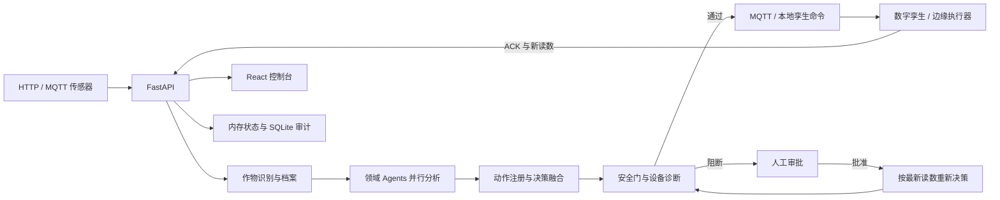

# 温室多智能体栽培系统

一个面向比赛演示、教学和原型验证的温室控制闭环：接收环境读数，由多个领域 Agent 并行分析，统一融合为执行器命令，再经过安全门、设备健康诊断和 HITL（Human-in-the-Loop）审批，最终驱动 MQTT 或进程内数字孪生。

> 当前版本：`0.2.0`。仓库已经具备可运行的前后端、数字孪生、故障注入、审计和离线 Docker 启动流程；它不是可直接接入真实温室的生产控制系统。

## 项目亮点

- **完整控制闭环**：传感器 → Agent 分析 → 决策融合 → 安全检查 → 命令下发 → ACK → 下一周期环境变化。
- **多智能体协作**：土壤、温度、湿度、病虫害、灌溉、光照/CO₂ 和生育期 Agent 并行运行。
- **安全优先**：极端温度、异常 pH、低置信度、未知动作、危险动作、设备冲突和传感器故障都会阻止自动下发。
- **人工审批**：危险决策不会保存旧命令等待重放；审批通过后会使用最新读数重新决策并再次校验。
- **可解释数字孪生**：内置正常、极端环境、传感器故障和执行器故障场景，命令会直接影响下一周期环境。
- **离线比赛部署**：可提前打包 Docker 镜像，在断网电脑上校验镜像并一键启动。
- **可选 DeepSeek**：只用于作物识别和作物档案生成；未配置密钥时自动使用本地规则与保守档案。

## 实际运行链路



系统有两种执行方式：

| 启动方式 | 控制链路 |
| --- | --- |
| Docker Compose | Mosquitto + API + 独立数字孪生 + 前端，使用真实 MQTT 消息和 ACK |
| 本地后端且未配置 `MQTT_BROKER` | 命令由进程内数字孪生执行，返回 `simulated_local`；选择场景后开始每 2 秒推进环境 |

所有专家 Agent 当前以确定性本地规则为主。Prompt 会被加载用于上下文记录，但尚未把每个专家 Agent 都交给大模型推理。

## 快速开始

### 方式一：Docker Compose（推荐）

要求：Docker Desktop 或 Docker Engine，并支持 `docker compose`。

```powershell
docker compose up --build --wait
```

启动后访问：

- 控制台：<http://localhost:5173>
- API：<http://localhost:8000>
- Swagger：<http://localhost:8000/docs>
- 健康检查：<http://localhost:8000/api/health>

Compose 会启动四个服务：`mosquitto`、`api`、`digital-twin` 和 `frontend`。所有宿主机端口都只绑定到 `127.0.0.1`。

停止服务：

```powershell
docker compose down
```

### 方式二：本地开发

要求：Python 3.11、Node.js `>=22.13.0`、Corepack。

在项目根目录安装并启动后端：

```powershell
python -m venv .venv
.\.venv\Scripts\python.exe -m pip install -r requirements.txt
.\.venv\Scripts\python.exe -m uvicorn backend.app.main:app --reload --host 0.0.0.0 --port 8000
```

另开一个 PowerShell 窗口启动前端：

```powershell
cd frontend
corepack enable
pnpm install --frozen-lockfile
pnpm run dev
```

Vite 会把 `/api` 和 `/ws` 代理到 `http://localhost:8000`。

## 五分钟演示

### 图形界面演示

1. 打开 <http://localhost:5173>。
2. 在“种植总栏”选择“正常生产”，观察环境数据、Agent 时间线和执行器状态。
3. 切换“高温干旱”，运行一轮决策，观察通风、灌溉命令及 ACK。
4. 切换“风机故障”或“灌溉无响应”，观察连续失败、ACK 超时、熔断和人工审批。
5. 切换“传感器固定值”“传感器异常值”或“传感器超时”，观察设备诊断与安全拦截。
6. 在“人工审批”和“历史审计”页面验证审批后重新决策及事件留痕。

内置场景如下：

| 场景 ID | 页面名称 | 演示内容 |
| --- | --- | --- |
| `normal` | 正常生产 | 常规闭环 |
| `hot_dry` | 高温干旱 | 通风与灌溉 |
| `cold_snap` | 低温寒潮 | 加热 |
| `low_light_co2` | 弱光低 CO₂ | 补光与补气 |
| `actuator_failed` | 风机故障 | failed ACK、失败累计与熔断 |
| `actuator_timeout` | 灌溉无响应 | ACK 超时与故障诊断 |
| `sensor_stuck` | 传感器固定值 | 连续相同读数诊断 |
| `sensor_abnormal` | 传感器异常值 | Pydantic 范围校验与异常审计 |
| `sensor_timeout` | 传感器超时 | 离线诊断 |

### API 演示：正常 → 危险 → HITL → 审计

启动后端后，在另一个 PowerShell 窗口执行：

```powershell
$normal = @{
    device_id = "demo-1"
    temperature = 25
    humidity = 68
    soil_moisture = 45
    ph = 6.2
    ec = 1.8
    light = 650
    co2 = 700
} | ConvertTo-Json

Invoke-RestMethod -Method Post -Uri http://localhost:8000/api/sensors/readings `
    -ContentType application/json -Body $normal
Invoke-RestMethod -Method Post -Uri http://localhost:8000/api/agents/run

$danger = $normal | ConvertFrom-Json
$danger.temperature = 45
$danger = $danger | ConvertTo-Json
Invoke-RestMethod -Method Post -Uri http://localhost:8000/api/sensors/readings `
    -ContentType application/json -Body $danger
Invoke-RestMethod -Method Post -Uri http://localhost:8000/api/agents/run

Invoke-RestMethod http://localhost:8000/api/hitl/pending
Invoke-RestMethod 'http://localhost:8000/api/audit/history?limit=20'
```

45℃ 超过代码中的 40℃ 安全红线，决策的 `dispatch.status` 应为 `blocked_by_safety`，并在 `/api/hitl/pending` 中生成待审批项。

仓库还提供一个简化脚本：

```powershell
.\.venv\Scripts\python.exe scripts\run_simulation.py
```

该脚本会连续上报三组相同的 35℃ 数据，随后上报 45℃ 数据；除高温拦截外，连续相同读数也可能触发传感器固定值诊断。

## 决策与安全机制

### Agent 与融合

`backend/app/decision_service.py` 是统一决策入口。API 触发、MQTT 传感器触发和 HITL 复核都复用同一流程：

1. 必要时识别作物并生成作物档案。
2. 并行运行领域 Agent。
3. 将 recommendation 通过 `action_registry.py` 映射为命令、告警或人工审批动作。
4. 检查安全红线、Agent 置信度、未知动作、执行器白名单、设备冲突和传感器健康。
5. 安全通过后下发命令；否则创建去重的 HITL 事件。
6. 保存决策、Agent 输出、分发结果和审计事件。

可自动控制的执行器为：

```text
ventilation  irrigation  heating  mister
grow_light   shade       co2      fan
```

`adjust_ph`、人工复核类建议、CO₂ 富集复核和 `pesticide_on` 不会直接自动执行；未知 recommendation 也不会被静默丢弃。

### 当前硬安全规则

- 温度大于 `40℃`。
- pH 小于 `4` 或大于 `8`。
- 出现化学农药命令。
- 除作物识别和生育期外，任一专家 Agent 置信度低于 `0.7`。
- 同一批命令同时开启 `heating` 和 `ventilation`。
- recommendation 或执行器未注册。
- 传感器固定值、离线或越界。
- 执行器连续失败达到阈值并进入熔断。

默认设备诊断阈值：传感器连续 `3` 次相同判定疑似卡死，`6` 秒无有效读数判定离线，ACK 等待 `5` 秒超时，执行器连续失败 `3` 次后熔断。均可通过环境变量覆盖。

## 作物识别

系统支持以下本地作物档案：

```text
tomato  lettuce  strawberry  cucumber  pepper
```

识别顺序为：

1. 配置 DeepSeek 时，调用 OpenAI-compatible `/chat/completions`。
2. 模型不可用时，从图像 URL、元数据和人工输入中匹配中英文关键词。
3. 仍无法识别时返回 `unknown` 和低置信度，进入人工确认。

作物档案默认写入 `config/crop_profiles.json`。仓库内的 `config/settings.yaml` 和 `config/safety_rules.yaml` 目前主要是规划/默认值参考，并未全部接入运行时；安全结果应以源码和测试为准。

## API 概览

完整参数和响应模型请查看运行中的 Swagger。

| 方法 | 路径 | 作用 |
| --- | --- | --- |
| `GET` | `/api/health` | API 健康与版本 |
| `POST` | `/api/sensors/readings` | 写入传感器读数 |
| `GET` | `/api/sensors/latest` | 查询最新读数 |
| `POST` | `/api/agents/run` | 运行完整决策链 |
| `GET` | `/api/agents/status` | 查询最近 Agent 输出 |
| `GET` | `/api/decisions` | 查询内存中的决策历史 |
| `GET` | `/api/hitl/pending` | 查询待审批项 |
| `POST` | `/api/hitl/{id}/approve` | 批准并按最新状态复核 |
| `POST` | `/api/hitl/{id}/reject` | 拒绝审批项 |
| `POST` | `/api/actuators/command` | 经注册表和安全门发送手工命令 |
| `GET` | `/api/dashboard/summary` | 前端总览快照 |
| `GET` | `/api/audit/history?limit=100` | 查询最近审计事件 |
| `GET` | `/api/digital-twin/scenarios` | 查询孪生场景 |
| `POST` | `/api/digital-twin/scenario` | 切换孪生场景 |
| `GET` | `/api/digital-twin/status` | 查询孪生、ACK 和设备诊断 |
| `WS` | `/ws/updates` | 发送一次状态快照 |

前端当前每 4 秒轮询 REST API；WebSocket 端点只发送一次快照，不是持续推送通道。

## 常用环境变量

| 变量 | 默认值 | 说明 |
| --- | --- | --- |
| `DEEPSEEK_API_KEY` | 空 | 为空时使用本地回退 |
| `DEEPSEEK_BASE_URL` | `https://api.deepseek.com/v1` | OpenAI-compatible 地址 |
| `DEEPSEEK_MODEL` | `deepseek-chat` | 文本模型 |
| `DEEPSEEK_VISION_MODEL` | 同文本模型 | 图像模型 |
| `DEEPSEEK_TIMEOUT` | `30` | 请求超时秒数 |
| `DEEPSEEK_RETRIES` | `2` | 失败重试次数 |
| `MQTT_BROKER` | 空 | API 未配置时使用进程内孪生 |
| `MQTT_PORT` | `1883` | Broker 端口 |
| `MQTT_SENSOR_TOPIC` | `greenhouse/sensors/+` | API 订阅的传感器主题 |
| `MQTT_ACTUATOR_TOPIC` | `greenhouse/actuators/commands` | 执行器命令主题 |
| `MQTT_ACK_TOPIC` | `greenhouse/actuators/ack` | ACK 主题 |
| `MQTT_TWIN_SCENARIO_TOPIC` | `greenhouse/digital-twin/scenario` | 场景切换主题 |
| `MQTT_TWIN_STATUS_TOPIC` | `greenhouse/digital-twin/status` | 孪生状态主题 |
| `TWIN_INTERVAL_SECONDS` | `2` | 独立孪生推进周期 |
| `SENSOR_STUCK_COUNT` | `3` | 固定值诊断次数 |
| `SENSOR_OFFLINE_SECONDS` | `6` | 传感器离线阈值 |
| `ACK_TIMEOUT_SECONDS` | `5` | ACK 超时阈值 |
| `ACTUATOR_FAILURE_LIMIT` | `3` | 执行器熔断阈值 |
| `CROP_PROFILE_PATH` | `config/crop_profiles.json` | 作物档案路径 |
| `VITE_API_BASE` | 空 | 前端生产 API 基地址 |

## 项目结构

```text
.
├── backend/app/
│   ├── api/                    # REST 与 WebSocket 路由
│   ├── agents/                 # 专家、融合、HITL 与编排 Agent
│   ├── decision_service.py     # 统一决策入口
│   ├── action_registry.py      # recommendation、风险与执行器映射
│   ├── device_health.py        # 传感器诊断、ACK、熔断
│   ├── mqtt_runtime.py         # MQTT 输入和 ACK 运行时
│   ├── local_twin.py           # 无 Broker 时的进程内孪生
│   └── db/session.py           # SQLite 审计
├── digital_twin/               # 场景、环境模型和 MQTT 闭环进程
├── frontend/                   # React + TypeScript + Vite 控制台
├── edge/mqtt/                  # HTTP 读数模拟器与 MQTT 命令消费者
├── config/                     # 作物档案及规划配置
├── scripts/                    # 模拟、离线制包和启动脚本
├── tests/                      # 后端与闭环回归测试
├── docs/                       # 架构、API、部署、安全和运维文档
└── docker-compose.yml          # 四服务编排
```

## 测试与构建

后端测试：

```powershell
.\.venv\Scripts\python.exe -m pytest -q
```

前端类型检查与生产构建：

```powershell
cd frontend
pnpm run typecheck
pnpm run build
```

当前测试覆盖健康检查、作物识别、Agent 管线、动作注册、安全门、HITL 重新校验、设备诊断、MQTT 状态处理和数字孪生。GitHub Actions 会执行同样的后端测试、类型检查和生产构建。

## 比赛离线启动

在联网电脑上使用最终代码制包：

```powershell
powershell -ExecutionPolicy Bypass -File scripts\package_offline.ps1
```

脚本会生成：

```text
deploy/offline/greenhouse-images.tar
deploy/offline/greenhouse-images.tar.sha256
```

把完整项目目录复制到比赛电脑后，双击 `start-offline.cmd`。启动脚本只校验并加载预制镜像，然后以 `--no-build --pull never` 启动，不会在现场安装 Python 或 Node 依赖。

详细验收步骤见 [比赛离线冷启动验收](docs/competition/offline-acceptance.md)。

## 当前边界

- 业务状态主要保存在 API 单进程内，重启后最新读数、决策和 HITL 列表会清空；SQLite 只持久化审计。
- SQLite 写入采用尽力而为策略，失败不会阻断控制流程。
- 数字孪生是便于演示因果关系的一阶模型，不是作物生理模型或 CFD 模型。
- 边缘 MQTT 默认 handler 只校验并记录命令，仓库不包含真实硬件驱动。
- Compose 中的 Mosquitto 允许匿名访问，仅适合本机离线演示。
- 当前没有用户认证、权限控制、TLS、数据库迁移和多实例状态同步。
- 接入真实设备前仍需物理急停、独立限位、断电保护、传感器校准和现场风险评估。

## 文档导航

- [项目结构与真实运行链路](docs/project-map.md)
- [API 参考](docs/api.md)
- [系统架构](docs/architecture.md)
- [安全与 HITL](docs/safety.md)
- [MQTT 协议](docs/mqtt.md)
- [部署指南](docs/deployment.md)
- [前端说明](docs/frontend.md)
- [测试说明](docs/testing.md)
- [运维手册](docs/operations.md)
- [故障排查](docs/troubleshooting.md)
- [硬件接入](docs/hardware.md)
- [用户手册](docs/user_manual.md)

## 许可证与安全声明

本项目采用 [MIT License](LICENSE)，仅面向研究、教学、比赛和仿真验证。MIT 许可证不构成安全认证或质量担保；不要把当前软件安全门、默认阈值或数字孪生结果直接视为真实农业生产环境的充分安全措施。
