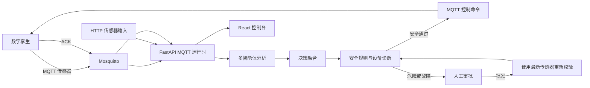

# 项目结构与真实运行链路

本文按当前可运行源码整理。缓存、SQLite 数据库和离线镜像包属于运行产物，不作为源码模块列出。

## 1. 控制闭环

危险决策不会保存并重放旧命令。人工批准后，系统使用最新传感器重新运行决策和安全检查；设备故障审批只解除熔断，下一轮决策再生成新命令。

## 2. 根目录与部署

| 路径 | 当前职责 |
| --- | --- |
| `README.md` | 项目说明、启动方式、API 与比赛演示入口 |
| `requirements.txt` | 固定版本的 Python 依赖 |
| `docker-compose.yml` | 编排 Mosquitto、API、数字孪生和前端；端口仅绑定 `127.0.0.1` |
| `backend/Dockerfile` | 构建 API 与数字孪生共用的 Python 镜像 |
| `frontend/Dockerfile` | 使用 pnpm 锁文件构建前端，再由 Nginx 提供静态资源 |
| `start-offline.cmd` | Windows 比赛现场离线一键启动入口 |
| `.github/workflows/ci.yml` | 执行 pytest、前端 typecheck 和生产构建 |
| `LICENSE` | MIT 许可证 |

## 3. 后端 `backend/app/`

| 路径 | 当前职责 |
| --- | --- |
| `main.py` | FastAPI 入口；挂载路由并启停 MQTT、健康监控和本地孪生 |
| `schemas.py` | 传感器、决策和命令模型；包含合理数据范围校验 |
| `state.py` | 当前读数、决策、HITL、ACK、设备诊断等单进程状态 |
| `decision_service.py` | 统一完成 Agent 调度、融合、安全、HITL、下发和审批后重新校验 |
| `action_registry.py` | recommendation 到执行器命令的白名单、风险和 HITL 定义 |
| `device_health.py` | 固定值、离线、ACK 超时、失败计数、熔断和设备故障 HITL |
| `mqtt_runtime.py` | 订阅传感器、孪生状态和 ACK，并触发统一决策服务 |
| `local_twin.py` | 未配置 MQTT Broker 时的进程内数字孪生回退 |
| `services.py` | 审计与兼容安全接口 |
| `db/session.py` | 使用 SQLite 保存审计事件 |
| `tools/actuator_dispatch.py` | 分配 command_id、建立 ACK 截止时间并发布 MQTT 命令 |

### API 路由

| 路径 | 当前职责 |
| --- | --- |
| `api/dashboard.py` | 总览、审计、阈值和健康检查 |
| `api/sensors.py` | 传感器写入与最新值读取 |
| `api/agents.py` | Agent 状态、运行和作物识别/档案接口 |
| `api/decisions.py` | 决策运行与最近决策 |
| `api/hitl.py` | 待审批、批准和拒绝 |
| `api/actuators.py` | 经过动作注册表和安全门的手工控制 |
| `api/digital_twin.py` | 场景列表、切换、状态与诊断 |
| `api/ws.py` | 状态快照 WebSocket |

### Agent

`agents/orchestrator.py` 并行调度温度、湿度、土壤、灌溉、光照/CO₂、生育期和病害规则分析；`agents/decision_agent.py` 负责融合为已注册动作。DeepSeek 仅用于可选的作物识别与档案生成，未配置密钥时使用本地回退。

## 4. 数字孪生 `digital_twin/`

| 路径 | 当前职责 |
| --- | --- |
| `engine.py` | 环境动态、执行器作用、传感器/执行器故障注入和 ACK |
| `scenarios.py` | 正常、极端环境、传感器和执行器故障场景 |
| `main.py` | MQTT 闭环进程；发布传感器与状态并更新容器健康心跳 |

## 5. 前端 `frontend/`

前端是已完成并参与构建的 React 控制台，不是占位模块。

| 路径 | 当前职责 |
| --- | --- |
| `src/App.tsx` | 页面导航和应用级错误边界 |
| `src/pages/Dashboard.tsx` | 实时指标、孪生场景、故障注入/诊断、设备控制、Agent 时间线和 HITL 抽屉 |
| `src/pages/Agents.tsx` | Agent 运行状态和分析结果 |
| `src/pages/HITL.tsx` | 人工审批、最新状态重新校验和设备熔断处理 |
| `src/pages/History.tsx` | 审计事件查询与中文格式化 |
| `src/pages/GreenhouseMap.tsx` | 温室分区和设备状态 |
| `src/components/` | 传感器、Agent、决策、告警和空状态组件 |
| `src/services/api.ts` | 带超时和错误归一化的 API 客户端 |
| `src/utils/i18n.ts` | 动态协议值到中文展示文案的集中映射 |
| `pnpm-lock.yaml` | 前端可复现依赖锁文件 |

## 6. 部署、脚本与测试

| 路径 | 当前职责 |
| --- | --- |
| `deploy/mosquitto/mosquitto.conf` | 仅供本机 Compose 使用的匿名 MQTT Broker 配置 |
| `deploy/nginx/default.conf` | 前端静态资源和 `/api`、`/ws` 反向代理 |
| `scripts/package_offline.ps1` | 构建并导出比赛离线镜像包与 SHA-256 |
| `scripts/start_offline.ps1` | 校验、加载镜像并以禁止拉取/构建模式启动和验收 |
| `scripts/run_simulation.py` | HTTP 传感器与决策冒烟脚本 |
| `tests/` | 决策、安全、HITL、设备诊断、数字孪生和 API 回归测试 |
| `docs/competition/offline-acceptance.md` | 新电脑断网冷启动与兜底录屏清单 |

## 7. 已知边界

- 业务状态主要保存在单个 API 进程内，重启会清空；SQLite 仅持久化审计。
- WebSocket 当前返回状态快照，前端主要使用 4 秒轮询。
- Compose 的匿名 MQTT 仅适合端口绑定到 `127.0.0.1` 的离线比赛演示；开放到局域网或公网前必须增加认证和 TLS。
- 当前闭环验证对象是数字孪生；接入真实硬件时需要单独实现驱动、校准和设备侧失联保护。
